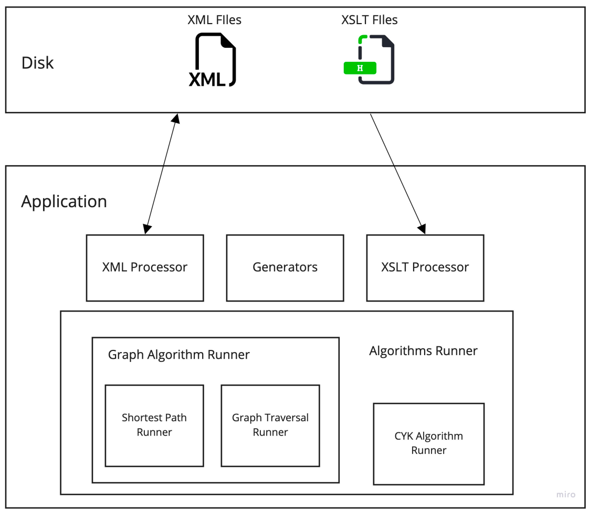
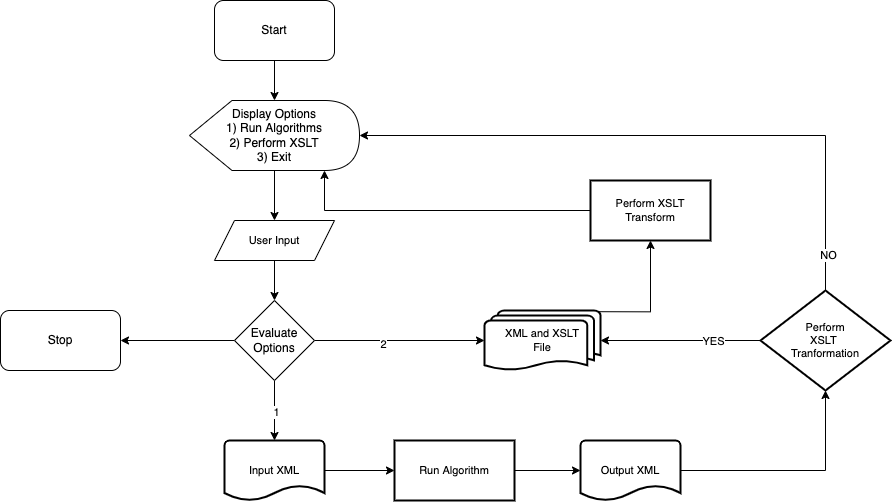

AlgorithmsVisualizer
======
Computer algorithms are difficult to comprehend and visualise because of the dynamic nature of their calculation. Most algorithms operate on data structures with multiple variables and abstract representations, which comprise the system's state. These procedures are difficult to understand as the variables involved in their computation are frequently modified through the iterative stages to solve a specific problem. The application provides a platform for implementing different algorithms and creating various visualisations and animations that offer snapshots of the system's internal state over the many iterations. The application strives to reduce the burden on Computer Science Professors by assisting in the production of learning resources like slides, reports, worksheets, quizzes, and more that need to be updated continuously.

Run
-----
The application can be run using the command

`java -jar target/AlgorithmsVisualizer-1.0-SNAPSHOT-spring-boot.jar`

Build
-----

The application can be built using the command

`mvn clean install` 

Architecture
-----
The system observes a monolithic architecture, also known as single-tiered architecture, which is the traditional model for designing a software program. This architecture combines the different components of the application onto a single platform. The Architecture Diagram, displayed in the figure, defines an abstract design for the system, indicating its constraints, relationships, and the boundaries shared by the various components. It provides a holistic view of the physical deployment of the system and its components.

The XML processing engine is used to marshal and unmarshal different XML documents. The Runner is responsible for executing different Algorithms and comprises different sub-runners like Graph and CYK runners, which cater to the specific requirements of different algorithms. The application also includes Graph Generators from the GrALoG software module to facilitate the creation of different graphs. The XSLT Processor is responsible for transforming XML documents into TeX files. All XML and XSLT files are read and written to the disk. The architecture implemented within the system allows for modular design with the capability to extend any module individually. The components in the system can also provide a template for adding any new components with minimal change.

The workflow in the figure describes the user's interaction with the system and the sequence of execution of the different steps to generate the desired output. The application provides an interactive interface for the user to select the desired route for processing the data. The application beings by describing a list of possible operations the system can perform. The user controls the flow of the program by selecting the appropriate route. All selections enumerate possible operations at each stage with the possibility of returning to the previous stage or terminating the application. Initially, the user can perform an XSLT transformation on a previously generated output or choose to execute an algorithm. The list of implemented algorithms is enumerated if the user chooses to evaluate an algorithm. The flowchart describes the
  different stages where user inputs are needed. The user can choose to return to the initial stage upon completing an algorithm or continue to perform an XSLT transformation on the recently created output.
